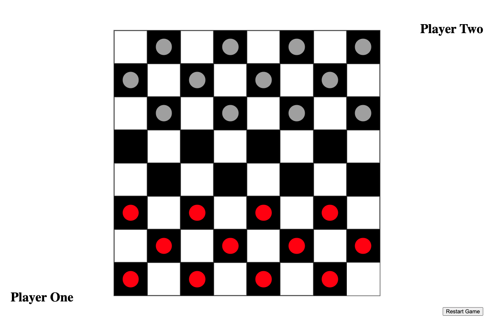
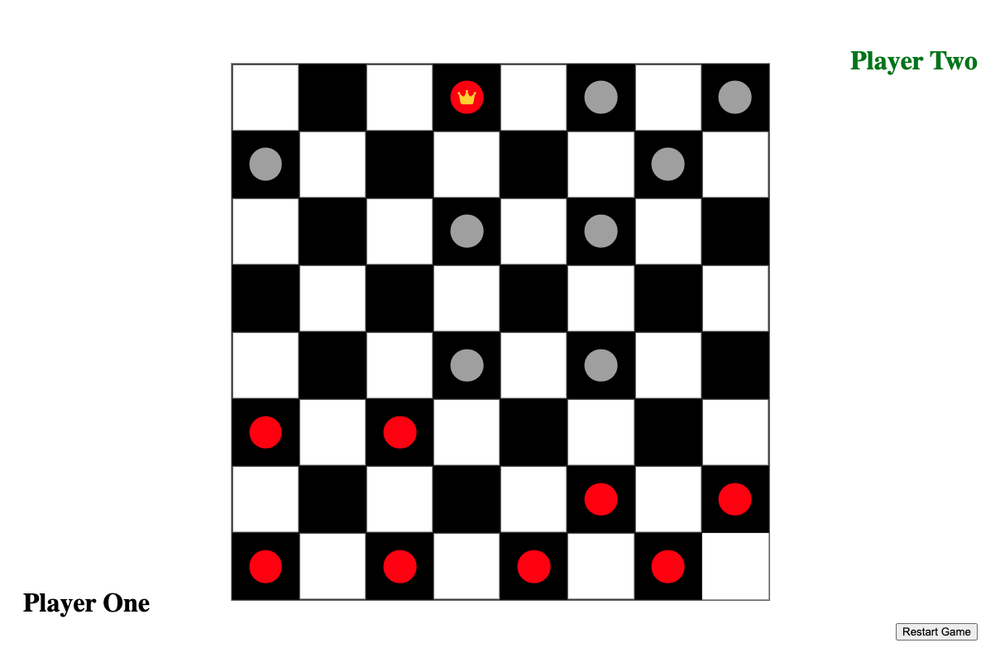
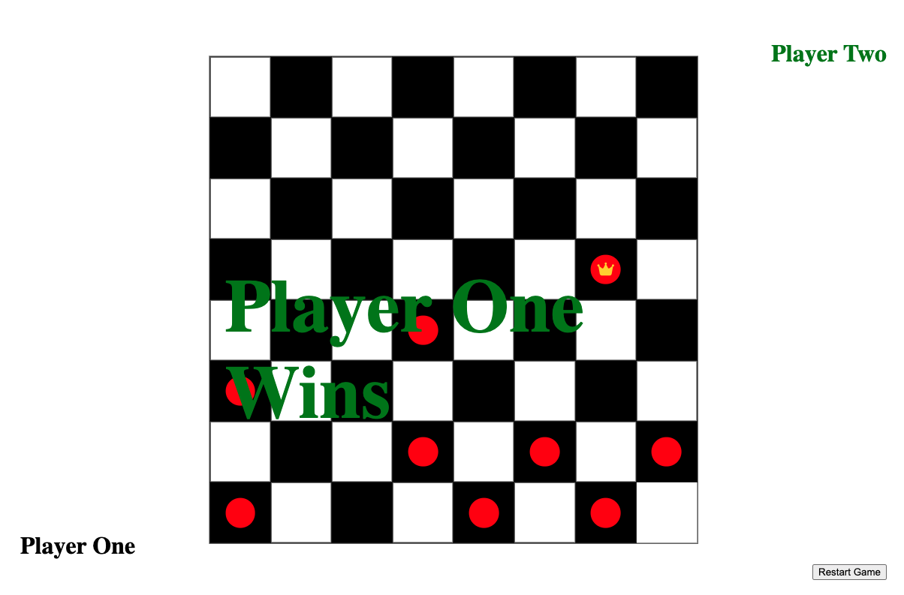

# Checkers
## Date 05/04/2023
### By Wilson Fung

***

### **_Description_**
#### Checkers is two person game played on an 8x8 board consisting of a checkered pattern. The goal is simple - to capture your opponent's pieces through various strategic moves in a diagonal direction. You are victorious when you have captured all your opponent's pieces or your opponent has no more moves to make.

#### You can play the game by clicking [here](https://wilsonscheckers.surge.sh).

***

### **_Technologies Used_**
- HTML
- CSS
- Javascript 

***

### **_Screenshots_**

***

### **_Credits_**
##### Markdown Cheatsheet: [Markdown Guide] (https://www.markdownguide.org/cheat-sheet/)

##### Checkers Rules: [Game Rules] (https://gamerules.com/rules/checkers-board-game/)

##### Background Image: [iStockPhoto] (https://media.istockphoto.com/id/1196178800/photo/cropped-view-of-man-and-woman-playing-in-checkers-on-wooden-background.jpg?s=612x612&w=0&k=20&c=LzdgD1ek6FOtzOICQ7oBM5s9nK-JmiqcmKAapHW0vUE=)